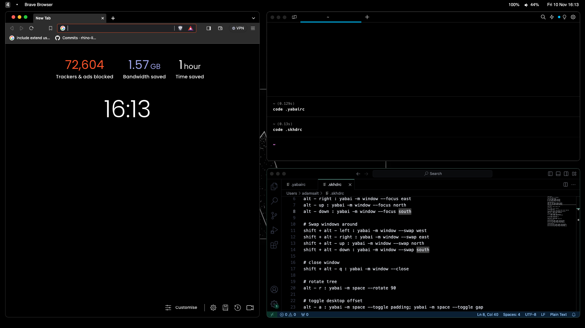

# osx-dotfiles
A truly dark theme for macOS using Yabai, Sketchybar and skhd

### Screenshot:

### Installation

[Install Yabai WM](https://github.com/koekeishiya/yabai/wiki#installation-requirements)

[Install Sketchybar](https://felixkratz.github.io/SketchyBar/setup)

[Install skhd](https://github.com/koekeishiya/skhd)

### Where config files go:

Root directory = home directory

.config = ~/.config

Pretty simple setup... well once you've gone through hoops to allow Yabai to work.

### Applications:

- Browser: Brave
- Terminal emulator: Warp
- Text editor: VSCode

### Themes

- Brave - [Just Black](https://chromewebstore.google.com/detail/just-black/aghfnjkcakhmadgdomlmlhhaocbkloab)
- Warp - Dark (default)
- VSCode - [Sytx](https://github.com/hshhrr/vscode-styx)